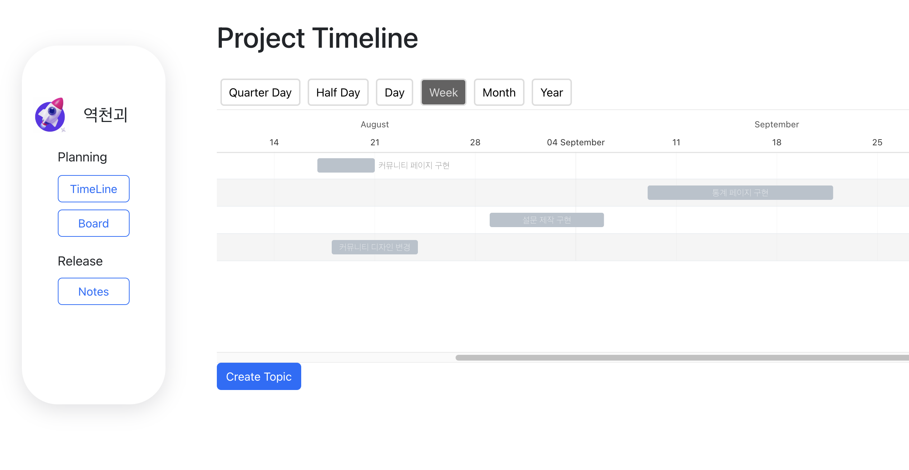

## 🙌 동시편집 기능을 제공하는 프로젝트 관리 플랫폼, A-Log

## ❓ A-Log가 뭐예요?

- **A-Log**는 **<u>프로젝트 멤버들간의 협업을 촉진시키기 위해</u>** 만들었어요.
- **실시간 동시편집** 기능을 제공하며 노션()처럼 다른 프로젝트 멤버의 작성내용을 실시간으로 확인할 수 있어요.
- Timeline, Board, Release Note를 통하여 프로젝트의 토픽, 이슈, 릴리즈 노트를 관리할 수 있어요.
- 깃헙 로그인의 간편 로그인 기능도 제공해요.

## 🙋‍♀️ 좀 더 구체적으로 가르쳐주세요!

1. 사용자는 팀을 만들 수 있고 팀을 만든 사람이 팀장(Team Leader)이예요.
2. 팀 안에서 프로젝트를 만들 수 있고 프로젝트를 만든 사람이 프로젝트장(Project Leader)이예요.
3. 팀장, 프로젝트장만 권한이 있는 기능들이 있어요. (팀 멤버 삭제, 프로젝트 멤버 삭제)
4. Timeline 페이지에서 프로젝트의 토픽(Topic)을 생성할 수 있어요.
5. Board 페이지에서 토픽의 하위항목인 이슈(Issue)를 생성할 수 있고 이때 연걸할 토픽을 고를 수 있어요.
6. Release Note 페이지에서는 작성된 릴리즈노트를 볼 수 있고, 릴리즈노트 작성페이지로 이동할 수 있어요.
7. 릴리즈노트 작성페이지에서는 작성 중인 곳이 다른 유저에게 **시각적으로** 표시되고, 작성 내용이 **실시간**으로 보여요.

## 🛠 기능 엿보기

3. [🛠 기능 엿보기](#-기능-엿보기)
   - [Timeline](#timeline)
   - [Board](#board)
   - [Release Note](#release-note)
   - [Landing Page](#landing-page)

## Timeline

 

## Board

    
   
## Release Note

    
   
## Landing Page
